# Final Architecture

At the end of Stage 11, Kira is a local web agent with a Python backend, a TypeScript frontend, safe local context tools, persistent conversation transcript, a project knowledge retrieval system, controlled Python execution, skill-defined reliable graph workflows, a typed/scoped memory system, and a focused chat-first frontend. The core does not contain business-specific graphs. It loads skills, registers tools, compiles graphs, streams events, checkpoints state, tracks side effects, stores conversation history, indexes local project knowledge, manages memory citations, and exposes a local UI for run control. Debug/inspector surfaces exist only as explicit non-default affordances; the default surface is the centered welcome plus the chat timeline/composer.

## Architecture Diagram

```mermaid
flowchart TB
  subgraph Frontend["frontend"]
    Welcome["Welcome Screen"]
    Workbench["Run Workbench"]
    TaskRail["Task Rail"]
    Composer["Prompt Composer"]
    Timeline["Execution Timeline"]
    TranscriptView["Transcript View"]
    EventView["Event Stream View"]
    StateView["State Inspector (non-default)"]
    HitlPanel["HITL Approval/Edit Panel"]
    ToolCard["Tool Result Cards"]
    ToolPanel["Tools and Schemas"]
    SkillPanel["Skill Catalog"]
    ProjectPanel["Project Knowledge Panel"]
    MemoryPanel["Memory Inspector"]
  end

  subgraph API["api"]
    Runs["POST /api/runs"]
    ConversationsApi["/api/conversations"]
    Events["GET /api/runs/{thread_id}/events"]
    Resume["POST /api/runs/{thread_id}/resume"]
    State["GET /api/runs/{thread_id}/state"]
    ProviderApi["GET /api/provider/status"]
    ToolsApi["GET /api/tools"]
    SkillsApi["GET /api/skills"]
    ProjectApi["/api/project"]
    MemoryApi["/api/memory"]
  end

  subgraph Core["agent_core"]
    Config["Model Config Loader"]
    ProviderSelector["Provider Selector"]
    Provider["Provider Adapter"]
    OpenAIProvider["OpenAI-compatible Provider"]
    Fixture["Fixture Provider"]
    EventNorm["Event Normalizer"]
    Context["ContextItem Builder"]
    Budget["Context Budget"]
    RunOrch["Run Orchestrator"]
    Transcript["Transcript Manager"]
    ConversationContext["Conversation Context Loader"]
    Compactor["Transcript Compactor"]
    Branching["Fork/Rollback Manager"]
    SkillContext["Skill Context Loader"]
    ProjectContext["Project Context Loader"]
    MemoryRetriever["Memory Retriever"]
  end

  subgraph Tools["tooling"]
    BaseTools["BaseTool Registry"]
    ProjectList["list_project_files"]
    ProjectSearch["search_project_files"]
    ProjectRead["read_project_file"]
    PythonRun["run_python_script"]
    AskQuestion["ask_user_question"]
  end

  subgraph Retrieval["retrieval"]
    RootResolver["ProjectRootResolver"]
    Inventory["ProjectInventory"]
    Chunker["ProjectChunker"]
    ProjectIndex["ProjectIndex"]
    ProjectRetriever["ProjectRetriever"]
    CitationBuilder["CitationBuilder"]
    ProjectPacker["Project ContextPacker"]
  end

  subgraph Graph["graph_runtime"]
    SkillLoader["Skill Loader"]
    SkillManifest["Skill Manifest Validator"]
    WorkflowFactory["Workflow Factory"]
    StateGraph["StateGraph"]
    ToolNode["ToolNode"]
    Conditions["Conditional Edges"]
    RunLock["Run Lock"]
    RetryPolicy["Retry Policy"]
    Idempotency["Idempotency Keys"]
    SideEffectGuard["Side-effect Guard"]
    Interrupt["interrupt"]
    Stream["astream_events"]
  end

  subgraph Storage["storage"]
    Checkpoints["SQLite Checkpointer"]
    RunLocks["Run Locks"]
    RunEvents["Run Events"]
    Conversations["Conversations"]
    TranscriptStore["Transcript Store"]
    ConversationSummaries["Conversation Summaries"]
    ConversationBranches["Conversation Branches"]
    ToolReplacements["Tool Output Replacements"]
    SideEffects["Side-effect Ledger"]
    Sessions["Session Projection"]
    ProjectStore["Project Index Store"]
    ProjectCitations["Project Citations"]
    Audit["Audit Log"]
    Memory["Memory Store"]
    MemoryCitations["Memory Citations"]
    MemoryEvents["Memory Events"]
    Traces["Context/Event Traces"]
  end

  Welcome --> Workbench
  Workbench --> TaskRail
  Workbench --> Composer
  Workbench --> Timeline
  Workbench --> TranscriptView
  Composer --> Runs
  TaskRail --> ConversationsApi
  Timeline --> EventView
  EventView --> Events
  HitlPanel --> Resume
  ToolCard --> Timeline
  StateView --> State
  StateView --> ProviderApi
  ToolPanel --> ToolsApi
  SkillPanel --> SkillsApi
  ProjectPanel --> ProjectApi
  MemoryPanel --> MemoryApi

  Runs --> RunOrch
  ConversationsApi --> Transcript
  Events --> Stream
  Resume --> Interrupt
  State --> Sessions
  ProviderApi --> ProviderSelector
  ToolsApi --> BaseTools
  SkillsApi --> SkillLoader
  ProjectApi --> ProjectRetriever
  MemoryApi --> Memory

  RunOrch --> ProviderSelector
  ProviderSelector --> Config
  ProviderSelector --> Provider
  Provider --> OpenAIProvider
  Provider --> Fixture
  RunOrch --> Context
  RunOrch --> Transcript
  RunOrch --> ConversationContext
  RunOrch --> Compactor
  RunOrch --> Branching
  RunOrch --> SkillContext
  RunOrch --> ProjectContext
  RunOrch --> MemoryRetriever
  Provider --> EventNorm
  OpenAIProvider --> EventNorm
  Fixture --> EventNorm
  Context --> Budget
  ConversationContext --> Context

  SkillLoader --> SkillManifest
  SkillManifest --> WorkflowFactory
  WorkflowFactory --> StateGraph
  RunLock --> StateGraph
  StateGraph --> Conditions
  StateGraph --> ToolNode
  StateGraph --> RetryPolicy
  StateGraph --> Idempotency
  StateGraph --> SideEffectGuard
  ToolNode --> BaseTools
  ToolNode --> ProjectList
  ToolNode --> ProjectSearch
  ToolNode --> ProjectRead
  ToolNode --> PythonRun
  ToolNode --> AskQuestion
  StateGraph --> Interrupt
  StateGraph --> Stream
  StateGraph --> Checkpoints
  RunLock --> RunLocks
  Stream --> RunEvents
  Stream --> Transcript
  SideEffectGuard --> SideEffects

  EventNorm --> Events
  Stream --> Events
  Checkpoints --> Sessions
  RunEvents --> Sessions
  Transcript --> Conversations
  Transcript --> TranscriptStore
  Transcript --> ConversationSummaries
  Branching --> ConversationBranches
  Compactor --> ConversationSummaries
  Compactor --> ToolReplacements
  BaseTools --> Audit
  PythonRun --> Audit
  ProjectRead --> Audit
  ProjectList --> RootResolver
  ProjectSearch --> RootResolver
  ProjectRead --> RootResolver
  RootResolver --> Inventory
  Inventory --> Chunker
  Chunker --> ProjectIndex
  ProjectIndex --> ProjectRetriever
  ProjectRetriever --> CitationBuilder
  CitationBuilder --> ProjectPacker
  ProjectPacker --> ProjectContext
  ProjectIndex --> ProjectStore
  CitationBuilder --> ProjectCitations
  SkillContext --> Context
  ConversationSummaries --> ConversationContext
  TranscriptStore --> ConversationContext
  ProjectContext --> Context
  Memory --> MemoryRetriever
  MemoryRetriever --> Context
  MemoryRetriever --> MemoryCitations
  MemoryCitations --> Audit
  Memory --> MemoryEvents
  Traces --> Budget
```



## Data Flow

| Flow | Steps |
| --- | --- |
| Provider selection | Run request override -> skill model hint -> configured default -> fixture fallback when no valid key is available |
| New run | Frontend posts task, optional provider/model, and selected skill -> backend creates `thread_id` -> provider is selected -> skill workflow compiles -> graph starts |
| Event stream | Graph `astream_events` -> Kira event mapper -> SSE -> frontend event view |
| Provider stream | OpenAI-compatible chunks -> provider adapter splits text/thinking/done/error -> normalized KiraEvents -> graph/SSE pipeline |
| Conversation run | Frontend selects or creates `conversation_id` -> backend creates `turn_id` and `thread_id` -> user message is linked to active head and persisted -> active transcript context is packed -> run streams |
| Transcript update | `text_delta` chunks append to visible assistant message -> tool/interrupt/resume/error events write bounded parts -> `done` marks the turn complete |
| Active history | Context builder walks `active_head_message_id` parent chain -> applies explicit compaction and replacement rules -> emits transcript ContextItems |
| Fork/rollback | Fork creates a new conversation from a selected message; rollback moves active head and records a marker without deleting original transcript |
| Tool replacement | Large/sensitive tool output is replaced by summary/stub plus hash/ref; provider context receives only bounded text |
| Tool call | Model or graph node requests tool -> `ToolNode` dispatches registered `BaseTool` -> result normalized and audited |
| Local file tool | Read-only project tool resolves root/path -> `rg` or Python fallback -> bounded result with file metadata |
| Project retrieval | Inventory refresh -> chunk/index -> live `rg` and FTS candidates -> ranking -> cited snippets -> `project_file` / `project_search` ContextItems |
| Python execution | Tool validates script/cwd/env -> optional approval -> subprocess with timeout/output caps -> structured result and audit |
| Skill activation | Skill catalog summary -> explicit or routed activation -> progressive `SKILL.md` / reference load -> skill ContextItems and workflow selection |
| Human interrupt | Node or tool calls `interrupt` -> checkpoint writes state -> SSE emits interrupt -> frontend posts resume value -> same `thread_id` continues |
| Reliable resume | Run lock acquired -> checkpoint loaded -> side-effect ledger checked -> completed work reused -> retry/cancel rules applied |
| Memory retrieval | Run text + workflow context -> MemoryRetriever -> top-k/dedupe/explain -> memory ContextItems -> citation records |
| Memory extraction | Completed run -> candidate extraction dry-run -> secret guard/dedupe -> optional HITL approval -> MemoryStore |
| Replay | Backend loads checkpoints/session projection -> emits projected state and trace for debug |
| Context build | Conversation summary/history, selected skill, project files, memory, and tool summaries become ContextItems -> budget builder produces provider input |

## Core Interfaces

```python
class KiraState(TypedDict, total=False):
    conversation_id: str | None
    turn_id: str | None
    active_head_message_id: str | None
    messages: list[dict]
    active_skill: str | None
    active_project_root: str | None
    provider_profile_id: str | None
    model: str | None
    fixture_fallback: bool
    project_context: list[dict]
    conversation_context: list[dict]
    memory_context: list[dict]
    pending_interrupt: dict | None
    errors: list[dict]
    workflow_state: dict
```

```python
class KiraEvent(TypedDict):
    type: Literal[
        "text_delta",
        "thinking_delta",
        "tool_start",
        "tool_result",
        "retry",
        "side_effect_reused",
        "checkpoint",
        "interrupt",
        "resume",
        "done",
        "error",
    ]
    thread_id: str
    seq: int
    data: dict
```

```python
class ContextItem(TypedDict, total=False):
    id: str
    kind: Literal[
        "base",
        "profile",
        "conversation_history",
        "conversation_summary",
        "compaction_summary",
        "tool_result",
        "tool_summary",
        "skill",
        "memory",
        "project_file",
        "project_search",
        "workflow",
        "permission",
    ]
    source: str
    content: str
    priority: int
    estimated_tokens: int
    metadata: dict
```

## API Surface

| Endpoint | Responsibility |
| --- | --- |
| `POST /api/conversations` | Create a local conversation |
| `GET /api/conversations` | List conversations with title, status, latest time, and archived flag |
| `GET /api/conversations/{conversation_id}` | Read conversation metadata |
| `PATCH /api/conversations/{conversation_id}` | Rename, archive, restore, or update metadata |
| `POST /api/conversations/{conversation_id}/fork` | Fork from a selected message/turn into a new conversation |
| `POST /api/conversations/{conversation_id}/rollback` | Move active head to a selected message/turn and record a rollback marker |
| `POST /api/conversations/{conversation_id}/compact` | Create or refresh an explicit compaction summary |
| `GET /api/conversations/{conversation_id}/transcript` | Read paginated transcript messages and parts |
| `GET /api/conversations/{conversation_id}/context` | Explain transcript summary/history/tool-summary context |
| `POST /api/runs` | Start a run with task text, optional `conversation_id`, project root, optional skill, model, and fixture script |
| `GET /api/runs/{thread_id}/events` | Stream KiraEvents over SSE |
| `POST /api/runs/{thread_id}/resume` | Resume an interrupt with user approval/edit/question response |
| `GET /api/runs/{thread_id}/state` | Return checkpoint/session projection |
| `GET /api/provider/status` | Return redacted provider readiness, default profile, model, key presence, and fixture fallback status |
| `GET /api/tools` | Return registered BaseTool metadata and JSON Schema |
| `GET /api/skills` | Return discovered skill metadata and workflow capabilities |
| `GET /api/project/index` | Return project inventory/index status |
| `POST /api/project/index/refresh` | Refresh allowed project inventory and index |
| `GET /api/project/search` | Search project knowledge with citations and stale markers |
| `GET /api/runs/{thread_id}/context` | Return included/omitted ContextItems for debug |
| `GET /api/memory` | Search/list memory records and explain retrieval |
| `POST /api/memory` | Add or approve memory records |
| `POST /api/memory/{id}/actions` | Archive, delete, merge, refresh, or promote memory |

## Skill Boundary

A skill may provide documentation, tools, context injectors, workflow definitions, UI metadata, model hints, permission hints, and fixtures. Core loads those pieces but does not hardcode skill-specific nodes. Business node names such as `planner`, `gen_data`, `send_kafka`, `wait_ds`, and `reflect` belong inside a skill package if they are needed. Skills may request configured model profiles, but they cannot supply raw provider secrets or base URLs.

## Memory Boundary

Memory is separate from transcript, skills, and project search. It stores only durable preferences, decisions, workflow lessons, references, and facts that are useful later and cannot be reliably derived from current files. Memory injection always creates citations and goes through ContextItem budgeting.

## Transcript Boundary

Transcript is the conversation-scoped short-term record used for ordinary follow-up continuity. It stores visible user/assistant messages, parent-chain ancestry, explicit compaction summaries, bounded tool summaries, replacement stubs, fork/rollback markers, interrupt/resume markers, and terminal status. It does not store hidden thinking as assistant answer text, does not replace graph checkpoints, and does not become durable user/project memory unless Stage 07 memory policy approves an extracted candidate.

## Graph Reliability Boundary

LangGraph owns graph execution primitives and checkpoint storage. Kira owns the reliability policy around those primitives: one active executor per `thread_id`, monotonic event sequence, retry classification, idempotency keys, side-effect ledger, cancellation, repair, and replay semantics. Replay is read-only by default and must not repeat completed side effects.

## Project Knowledge Boundary

Project knowledge is separate from memory. It is derived from current local files, can become stale, and must always carry citations. It may write Kira-owned index/cache records, but it never mutates project files. Retrieved project text is treated as untrusted data, not as instructions.

## Provider Boundary

Provider configuration is user-local and redacted. Kira may load `preset`, `provider`, `baseURL`, `apiKey`, `model`, timeout, and retry policy from the configured model profile, but graph state, checkpoints, traces, frontend status, and skill manifests must never contain raw API keys. Provider stream parsing is centralized in the provider adapter; downstream graph/SSE layers consume normalized KiraEvents only.
